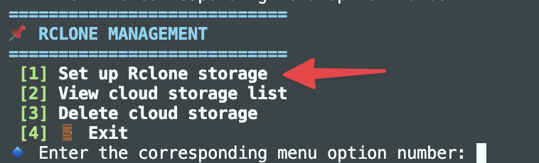

# Setup rclone storage

+++ Vietnamese 🇻🇳

[Rclone](https://rclone.org) được tích hợp vào WP Docker giúp người dùng có thể chủ động tải tập tin backup từ máy chủ WP Docker lên các dịch vụ lưu trữ đám mây như Google Drive, OneDrive, Dropbox, S3,...ngoài ra bạn cũng có thể tận dụng lệnh `rclone` để thao tác thêm những tác vụ khác theo nhu cầu.

Để sử dụng được Rclone trong WP Docker, bạn phải thực hiện cài đặt để lưu thông tin thiết lập Rclone vào WP Docker, bằng cách truy cập qua menu và tìm chức năng Quản lý Rclone, sau đó chọn chức năng Thiết lập storage Rclone.



Bước đầu tiên là bạn sẽ cần nhập tên storage cần thiết lập, tên storage này để phân biệt các storage khác nếu bạn có sử dụng nhiều storage khác nhau.

Sau khi nhập tên storage và nếu hợp lệ thì sẽ qua bước chọn loại storage cần thiết lập. WP Docker tích hợp sẵn trên menu thiết lập với Google Drive, Dropbox, S3 Storage (AWS hoặc các dịch vụ S3 tương tự).

Để thuận tiện cho việc thiết lập, WP Docker khuyến khích bạn cài đặt Rclone trên máy tính để có thể sử dụng được lệnh `rclone authorized` nhằm lấy mã token thông qua xác thực oAuth trên trình duyệt thuận tiện hơn. 

!!!danger Bảo vệ token
Mọi thông tin thiết lập của Rclone sẽ được lưu trữ tại tập tin `/opt/wp-docker/shared/config/rclone/rclone.conf` và WP Docker để Rclone đọc thông tin này lưu trên máy chủ của bạn. Bạn hãy tự bảo vệ nội dung tập tin này và cũng không được xóa đi, nếu xóa bạn phải thiết lập storage lại từ đầu.

Trong tương lai, WP Docker sẽ có bổ sung thêm một số cách bảo mật thông tin, ví dụ như mã hóa token.
!!!

## Cài đặt rclone trên máy tính

Để thuận tiện cho việc thiết lập, bạn nên cài đặt Rclone trên máy tính để có thể sử dụng được lệnh `rclone` trên máy để hỗ trợ lấy token thông qua xác thực oAuth trên trình duyệt.

### Cài đặt Rclone trên Linux

```bash
sudo -v ; curl https://rclone.org/install.sh | sudo bash
```

#### Cài đặt Rclone trên macOS với `homebrew`

```shell
brew install rclone
```

### Cài đặt Rclone trên Windows

Rclone cung cấp bộ cài sẵn để cài đặt thông qua file `.exe`. Xem thêm tại [https://rclone.org/install/#windows](https://rclone.org/install/#windows).

Sau khi cài xong, mở cửa sổ CMD hoặc Powershell để chạy lệnh `rclone`.

+++ English 🇬🇧

[Rclone](https://rclone.org) is integrated into WP Docker, allowing users to actively upload backup files from the WP Docker server to cloud storage services like Google Drive, OneDrive, Dropbox, S3, etc. Additionally, you can use the `rclone` command for other tasks as needed.

To use Rclone in WP Docker, you need to set it up by saving the Rclone configuration information into WP Docker. Access the menu and find the Rclone Management function, then select the Setup Rclone Storage option.


The first step is to enter a name for the storage you want to set up. This name helps distinguish between different storage services if you use multiple ones.

After entering a valid storage name, you'll proceed to select the type of storage to set up. WP Docker has pre-integrated options in the setup menu for Google Drive, Dropbox, and S3 Storage (AWS or similar S3 services).

For easier setup, WP Docker recommends installing Rclone on your computer to use the `rclone authorized` command, which helps obtain tokens through oAuth authentication in the browser more conveniently.

!!!danger Protecting Tokens
All Rclone configuration information is stored in the file `/opt/wp-docker/shared/config/rclone/rclone.conf`, and WP Docker allows Rclone to read this information stored on your server. You must protect the contents of this file and not delete it. If deleted, you'll need to set up the storage again from scratch.

In the future, WP Docker will add more security measures for this information, such as token encryption.
!!!

## Installing Rclone on Your Computer

For easier setup, you should install Rclone on your computer to use the `rclone` command locally, which helps obtain tokens through oAuth authentication in the browser.

### Installing Rclone on Linux

```bash
sudo -v ; curl https://rclone.org/install.sh | sudo bash
```

#### Installing Rclone on macOS with `homebrew`

```shell
brew install rclone
```

### Installing Rclone on Windows

Rclone provides a pre-built installer through `.exe` files. See more at [https://rclone.org/install/#windows](https://rclone.org/install/#windows).

After installation, open CMD or Powershell to run the `rclone` command.