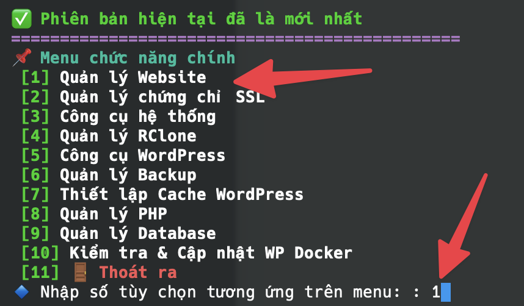
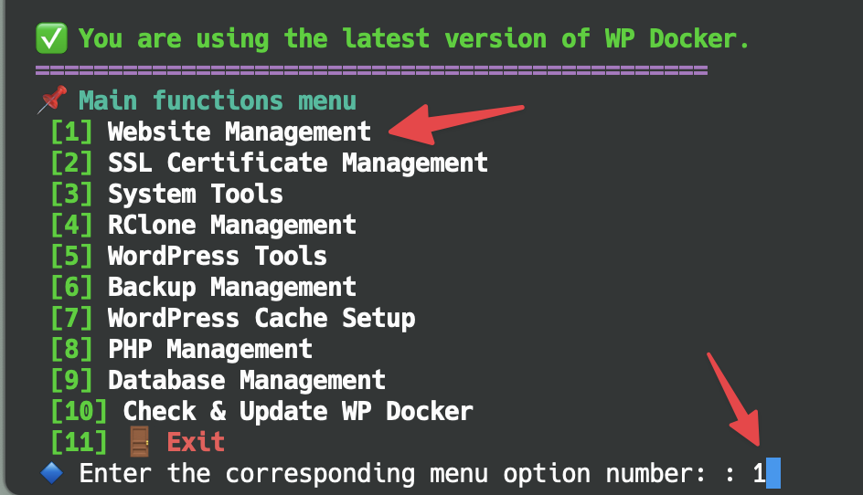

# Create New Website

+++ Vietnamese 🇻🇳

Trong WP Docker, dù bạn đang muốn có một website mới hoàn toàn hay cần chuyển dữ liệu một website có sẵn về hệ thống thì bạn cần phải thực hiện tạo tác Tạo website mới trên hệ thống WP Docker trước. Việc tạo website sẽ giúp hệ thống tự động thêm các cấu hình virtual host cho webserver để website tồn tại trên hệ thống.

Khi tạo website trên WP Docker, nó cũng sẽ tự động cài đặt một website WordPress mới mặc định, nhưng đừng lo lắng mình sẽ hướng dẫn bạn chuyển dữ liệu một website đang có sẵn về hệ thống sau.

Để tạo website, bạn mở menu với lệnh `wpdocker` và nhập số tùy chọn tương ứng với chức năng Quản lý website.

Tiêp theo bạn chọn chức năng Tạo website mới.

Khi truy cập vào chức năng Tạo website mới, bạn sẽ cần nhập tên miền website cần sử dụng trên hệ thống WP Docker và chọn phiên bản PHP cần sử dụng. 

!!!info Sử dụng phiên bản PHP tùy chỉnh
Nếu bạn không tìm thấy phiên bản PHP cần sử dụng trong menu chọn, bạn có thể chọn sử dụng phiên bản PHP tùy chỉnh và nhập số phiên bản cần sử dụng. WP Docker đang sử dụng image PHP của Bitnami nên bạn có thể xem các phiên bản PHP có thể sử dụng được tại https://hub.docker.com/r/bitnami/php-fpm/tags và nhập tên phiên bản dựa vào Tag trên Docker Hub. Ví dụ bạn có thể nhập `8.4.6` hoặc `8.4.6-debian-12-r2` đều được.
!!!

Sau đó tiếp tục thao tác tạo website theo hướng dẫn trên giao diện terminal. Nếu bạn chọn hệ thống tự tạo mật khẩu và tên người dùng ngẫu nhiên thì hãy lưu lại các thông tin đó khi quá trình cài đặt hoàn tất.

+++ English 🇬🇧

In WP Docker, whether you want to create a completely new website or migrate an existing one to the system, you first need to create a new website on the WP Docker system. Creating a website will help the system automatically add virtual host configurations to the webserver so the website can exist on the system.

When creating a website in WP Docker, it will also automatically install a default new WordPress website, but don't worry - I'll guide you through migrating an existing website to the system later.

To create a website, open the menu using the `wpdocker` command and enter the number corresponding to the Website Management function.

Next, select the Create New Website function.

When accessing the Create New Website function, you'll need to enter the domain name for the website you want to use on the WP Docker system and select the PHP version you want to use.

!!!info Using Custom PHP Version
If you can't find the PHP version you need in the selection menu, you can choose to use a custom PHP version and enter the version number you want to use. WP Docker uses Bitnami's PHP image, so you can check available PHP versions at https://hub.docker.com/r/bitnami/php-fpm/tags and enter the version name based on the Tag on Docker Hub. For example, you can enter `8.4.6` or `8.4.6-debian-12-r2`.
!!!

Then continue with the website creation process following the instructions on the terminal interface. If you choose to let the system generate random passwords and usernames, make sure to save that information when the installation is complete.