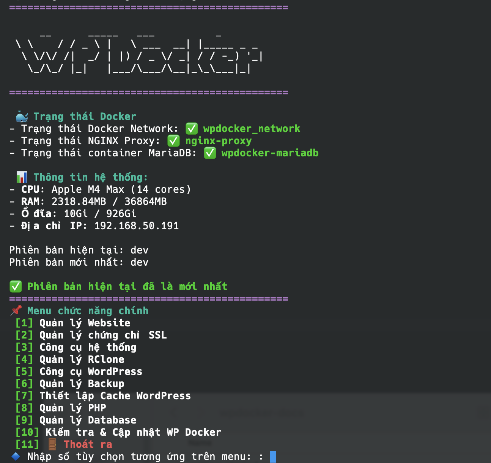

# Introduction ❤️

+++ Vietnamese 🇻🇳

WP Docker là một dự án Bash script được thiết kế để thiết lập môi trường Docker container dành cho mã nguồn WordPress. Với các ưu điểm của Docker, bạn sẽ có được một môi trường vận hành website WordPress bảo mật, hiệu năng cao trên máy chủ/VPS hoặc trên máy tính macOS của bạn chỉ với vài thao tác đơn giản.

WP Docker được thiết kế để vận hành cùng lúc nhiều webite WordPress trên cùng máy chủ, mỗi website là một container PHP riêng có thể tùy chỉnh phiên bản và cấu hình độc lập, hỗ trợ tự động cấu hình PHP dựa theo tài nguyên của VPS để website hoạt động ở trạng thái tối ưu.

Mục tiêu của WP Docker là tận dụng khả năng đóng gói và triển khai tức thời của Docker để xây dựng môi trường chuyên nghiệp đặc biệt tối ưu cho WordPress, cài đặt nhanh chóng với các image chính thức được cập nhật thường xuyên (Bitnami PHP, MariaDB Official), đặc biệt là sẽ có tính năng di chuyển toàn bộ dữ liệu của website chạy trên WP Docker qua một máy chủ khác chỉ với một thao tác duy nhất hoàn toàn tự động.

## Ưu điểm của WP Docker

- Mã nguồn mở, miễn phí hoàn toàn và không thương hiệu
- Container hóa 100% với Docker & Docker compose
- Bảo mật PHP giữa các website với cơ chế mỗi website là một container PHP độc lập
- Giao diện sử dụng thông qua terminal
- Gọn nhẹ và cài đặt nhanh chóng
- Sử dụng các image chính thức từ Bitmami, MariaDB được cập nhật thường xuyên
- Dễ sử dụng và cài đặt
- Container hóa toàn bộ, không ảnh hưởng đến các phần mềm khác trên VPS
- Dễ dàng gỡ bỏ cài đặt mà không ảnh hưởng đến hệ thống
- Di chuyển dữ liệu dễ dàng giữa các máy chủ

## Chức năng chính

- Triển khai môi trường webserver tối ưu cho WordPress với OpenResty (NGINX với sự hỗ trợ của Lua), PHP-FPM, MariaDB
- Có thể mở rộng và hỗ trợ nhiều webserver như NGINX, Caddy Server, OpenLiteSpeed (sắp ra mắt)
- Công cụ sao lưu và lên lịch sao lưu tự động, tùy chọn lưu trên máy chủ hoặc trên Google Drive, S3, Dropbox,...
- Dễ dàng khôi phục dữ liệu từ bản sao lưu
- Khôi phục dữ liệu từ file sao lưu trên Google Drive, Dropbox, S3,...(sắp ra mắt)
- Giao diện quản lý terminal và lệnh command line tích hợp (kiểu như `wpdocker website list`)
- NGINX được tích hợp sẵn WAF bảo mật cho website
- Hỗ trợ nhiều phiên bản PHP khác nhau (bất kỳ phiên bản nào mà Bitnami hỗ trợ)
- Cấu hình cache tự động cho mọi loại webserver và tối ưu gồm FastCGI Cache (NGINX Only) + Redis Object, WP Super Cache, WP Fastest Cache, W3 Total Cache.
- Và nhiều hơn thế nữa....

## Menu chức năng

||| **Quản lý website**

- Tạo website mới (và tự cài đặt WordPress mặc định)
- Xóa webite
- Danh sách website
- Khởi động lại website
- Xem log website
- Xem thông tin website
- Chuyển dữ liệu WordPress về WP Docker

||| **Quản lý SSL**

- Tạo chứng chỉ tự ký
- Cài chứng chỉ thủ công (trả phí)
- Cài chứng chỉ miễn phí Let's Encrypt
- Sửa chứng chỉ
- Kiểm tra thông tin chứng chỉ
|||

||| **Công cụ hệ thống**

- Kiểm tra tài nguyên
- Quản lý container Docker
- Dọn dẹp Docker
- Rebuild NGINX
- Thay đổi ngôn ngữ
- Thay đổi kênh phiên bản

||| **Quản lý Rclone**

- Thiết lập storage Rclone
- Xem danh sách storage
- Xóa storage
|||

||| **Công cụ WordPress**

- Reset mật khẩu admin
- Reset quyền người dùng (user role)
- Bật/tắt tự động cập nhật plugin 
- Bật/tắt bảo vệ wp-login.php
- Chuyển dữ liệu website WordPress về WP Docker

||| **Quản lý backup**

- Sao lưu website ngay
- Quản lý backup
- Lên lịch backup tự động
- Quản lý lịch backup
- Khôi phục dữ liệu
|||
||| **Thiết lập Cache**
Chọn website, sau đó chọn loại cache cần cài đặt:
- FastCGI Cache + Redis
- W3 Total Cache
- WP Fastest Cache
- WP Super Cache
- No Cache 
||| **Quản lý PHP**

- Thay đổi phiên bản PHP
- Rebuild PHP container
- Chỉnh sửa php-fpm.conf
- Chỉnh sửa php.ini
|||
||| **Quản lý Database**

- Reset database của website
- Xuất dữ liệu database
- Nhập dữ liệu database

||| **Kiểm tra và cập nhật WP Docker**
Khi chọn tính năng này sẽ kích hoạt cập nhật phiên bản WP Docker mới nhất.
|||

## Roadmap

Ngày dự kiến ra mắt phiên bản ổn định đầu tiên v1.2.0 vào ngày 05/05/2025. *Tại sao lại bắt đầu từ v1.2.0*?, để cho có "phong thủy" tốt.

### From v1.2.0 to v1.9.0

- Focus on stabilizing core feature functionalities
- Add new features: Telegram notification, Fail2ban integration
- Support configuration for WordPress Multisite

### v2.0.0

- Refactor to support multiple web servers
- Integrate additional web servers: Caddy Server, OpenLiteSpeed

### v3.0.0

- Enable cluster support using Docker Swarm

+++ English 🇬🇧

WP Docker is a Bash script project designed to set up Docker container environments for WordPress source code. Leveraging Docker's advantages, you can get a secure, high-performance WordPress website environment on your server/VPS or macOS computer with just a few simple steps.

WP Docker is designed to run multiple WordPress websites simultaneously on the same server, with each website having its own PHP container that can be customized independently in terms of version and configuration. It automatically configures PHP based on your VPS resources to ensure optimal website performance.

The goal of WP Docker is to utilize Docker's packaging and instant deployment capabilities to build a professional environment specifically optimized for WordPress. It offers quick installation with regularly updated official images (Bitnami PHP, MariaDB Official) and features the ability to migrate an entire website's data from one WP Docker instance to another with a single automated operation.

## Key Benefits of WP Docker

- Open source, completely free, and unbranded
- 100% containerized with Docker & Docker Compose
- Secure PHP isolation between websites with independent PHP containers
- Terminal-based user interface
- Lightweight and quick installation
- Uses regularly updated official images from Bitnami and MariaDB
- Easy to use and install
- Fully containerized, no impact on other software on the VPS
- Easy to uninstall without affecting the system
- Simple data migration between servers

## Main Features

- Deploy an optimized WordPress webserver environment with OpenResty (NGINX with Lua support), PHP-FPM, and MariaDB
- Extensible with support for multiple webservers like NGINX, Caddy Server, OpenLiteSpeed (coming soon)
- Backup tools with automatic scheduling, options to store on server or cloud services (Google Drive, S3, Dropbox, etc.)
- Easy data restoration from backups
- Restore data from backup files on Google Drive, Dropbox, S3, etc. (coming soon)
- Integrated terminal management interface and command line tools (like `wpdocker website list`)
- NGINX with built-in WAF security for websites
- Support for multiple PHP versions (any version supported by Bitnami)
- Automatic cache configuration for all webserver types, including FastCGI Cache (NGINX Only) + Redis Object, WP Super Cache, WP Fastest Cache, W3 Total Cache
- And much more...

## Feature Menu

||| **Website Management**

- Create new website (with default WordPress installation)
- Delete website
- List websites
- Restart website
- View website logs
- View website information
- Migrate WordPress data to WP Docker

||| **SSL Management**

- Create self-signed certificate
- Install manual certificate (paid)
- Install free Let's Encrypt certificate
- Edit certificate
- Check certificate information
|||

||| **System Tools**

- Check system resources
- Manage Docker containers
- Clean up Docker
- Rebuild NGINX
- Change language
- Change version channel
|||

||| **Rclone Management**

- Set up Rclone storage
- View storage list
- Delete storage
|||

||| **WordPress Tools**

- Reset admin password
- Reset user roles
- Enable/disable automatic plugin updates
- Enable/disable wp-login.php protection
- Migrate WordPress website data to WP Docker

||| **Backup Management**

- Backup website immediately
- Manage backups
- Schedule automatic backups
- Manage backup schedules
- Restore data
|||

||| **Cache Settings**
Select website, then choose cache type:
- FastCGI Cache + Redis
- W3 Total Cache
- WP Fastest Cache
- WP Super Cache
- No Cache
|||

||| **PHP Management**

- Change PHP version
- Rebuild PHP container
- Edit php-fpm.conf
- Edit php.ini
|||

||| **Database Management**

- Reset website database
- Export database data
- Import database data
|||

||| **Check and Update WP Docker**
This feature activates the update to the latest WP Docker version.
|||

## Roadmap

The first stable version v1.2.0 is scheduled for release on May 5, 2025. *Why start with v1.2.0?* For good "feng shui".

### From v1.2.0 to v1.9.0

- Focus on stabilizing core feature functionalities
- Add new features: Telegram notification, Fail2ban integration
- Support configuration for WordPress Multisite

### v2.0.0

- Refactor to support multiple web servers
- Integrate additional web servers: Caddy Server, OpenLiteSpeed

### v3.0.0

- Enable cluster support using Docker Swarm